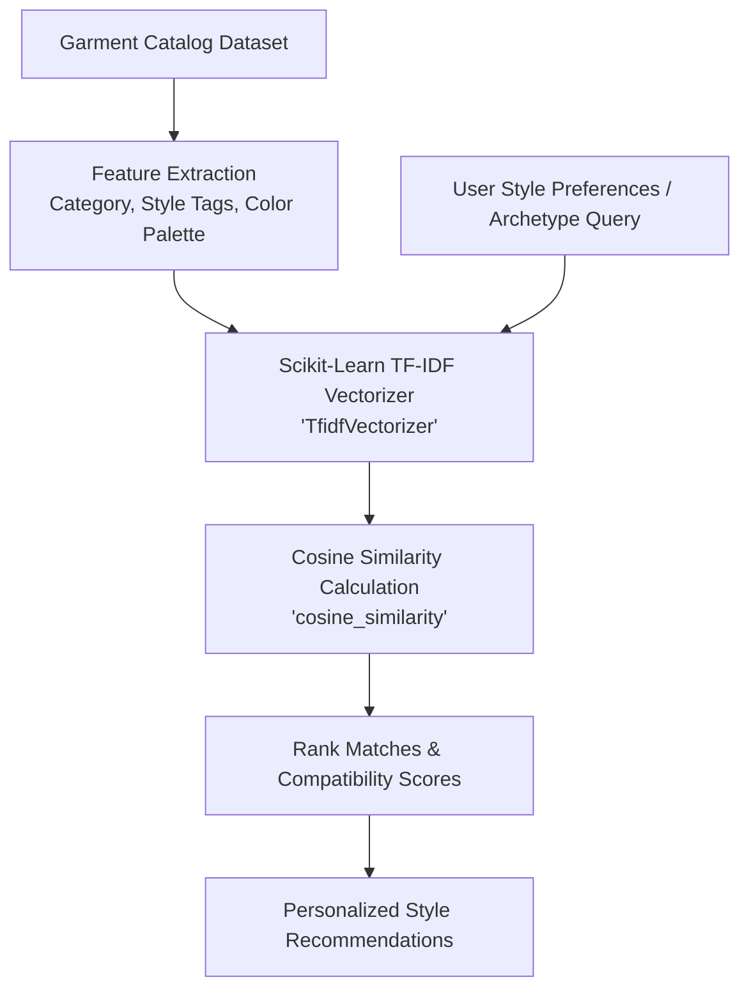

# 🌟 FashionAI - Virtual Try-On & Style Recommendation System

An innovative, full-stack fashion technology platform that combines **AI-powered Virtual Try-On** (Computer Vision & MediaPipe Segmentation), **Personalized Style Recommendations** (Scikit-Learn Machine Learning), **Outfit Compatibility Matching**, and **Real-Time Fashion Trend Radar**.

---

## 📌 Project Overview

**FashionAI** addresses a core challenge in modern e-commerce and personal styling: *photorealistically visualizing how garments look on an individual before purchasing*. 

By fusing MediaPipe Semantic Selfie Segmentation, OpenCV Poisson Seamless Cloning, LAB Color Space lighting transfer, and Scikit-Learn feature vector similarity, FashionAI provides:

1. **Virtual Fitting Studio**: Photorealistic garment synthesis on user webcam captures, uploaded photos, or preset avatars using **MediaPipe** semantic segmentation, **OpenCV** Poisson image editing (`cv2.seamlessClone`), straight upright positioning, and LAB skin tone color grading.
2. **Live OpenCV Camera Studio**: Integrated webcam modal enabling real-time facial capture with automatic instant virtual try-on previews.
3. **Personalized Style Engine**: Scikit-Learn TF-IDF vectorization and cosine similarity ranking tailored to individual style profiles and occasions.
4. **Outfit Matching Matrix**: AI synergy scoring (0-100%) and color wheel contrast analysis between any two garments.
5. **Fashion Trend Radar**: Global runway and social trend tracking with growth velocity metrics.
6. **Saved Virtual Closet**: Persistent wardrobe gallery for storing, managing, and exporting synthesized try-on creations.

---

## 🛠️ Tech Stack

### **Frontend**
- **Framework**: React.js 18 with **TypeScript**
- **Build Tool**: Vite 5
- **Styling**: Vanilla CSS & Tailwind CSS with custom glassmorphism design tokens & luxury typography (`Playfair Display` + `Plus Jakarta Sans`)
- **Icons**: Lucide React
- **Canvas Engine**: HTML5 Canvas with base64 image renderer & real-time webcam video stream integration

### **Backend**
- **Web Framework**: Python 3.12 Flask REST API
- **Middlewares**: Flask-CORS, Werkzeug, python-dotenv
- **Testing**: Pytest & Python `unittest` automated test suite (8/8 PASSED)

### **AI & Computer Vision Pipeline**
- **Semantic Segmentation**: **MediaPipe** Selfie Segmentation (`mediapipe.solutions.selfie_segmentation`) for precision head, hair, and neck alpha mask extraction
- **Computer Vision (CV)**: **OpenCV** (`cv2.seamlessClone` Poisson Image Editing, `cv2.getRotationMatrix2D`, `cv2.warpAffine`, `cv2.cvtColor` LAB Color Transfer, `cv2.GaussianBlur`, `cv2.CascadeClassifier`), Pillow, NumPy
- **Machine Learning (ML)**: **Scikit-Learn** (`TfidfVectorizer`, `cosine_similarity`), NumPy
- **Database**: **MongoDB** (PyMongo driver with transparent in-memory fallback store)

---

## 🏗️ System Design & Architecture

### **1. High-Level Architecture Diagram**

```mermaid
graph TD
    User([User / Web Browser]) <--> |HTTP / JSON REST API| Frontend[React.js + TypeScript Frontend\n(Vite + Tailwind CSS + HTML5 Canvas)]
    Frontend <--> |REST API Requests| Backend[Python Flask Backend API Server\n(app.py)]
    
    subgraph AI & Computer Vision Engines
        Backend <--> |Semantic Masking & Poisson Blend| MediaPipeCV[MediaPipe + OpenCV Engine\n(cv_engine.py)]
        Backend <--> |TF-IDF & Cosine Similarity| ML[Scikit-Learn Recommender\n(ml_recommender.py)]
        Backend <--> |PyMongo CRUD / Memory Store| DB[(MongoDB Database\n/ In-Memory Store)]
    end
```

---

### **2. Computer Vision Virtual Try-On Pipeline**

```mermaid
flowchart TD
    Webcam[Live OpenCV Webcam / User Photo] & Garment[Studio Outfit Base Canvas] --> Decode[Image Normalization & 600x800 Resizing]
    
    subgraph Face & Target Box Alignment
        Garment --> DetectModel[Detect Model Head Coordinates\n'CascadeClassifier.detectMultiScale']
        DetectModel --> TargetBox[Calculate Target Placement Box\nShifted Y-Offset for Hair Crown Coverage]
        Webcam --> DetectUser[Detect User Head Region]
        DetectUser --> CropUser[Crop Head, Hair & Chin Area]
    end
    
    subgraph Color Grading & Tone Matching
        CropUser & Garment --> LAB[LAB Color Space Transformation\n'cv2.cvtColor BGR2LAB']
        LAB --> ToneMatch[Luminance & Histogram Tone Matching\nMatch User Skin Tone to Studio Lighting]
    end

    subgraph Semantic Segmentation & Poisson Seamless Cloning
        ToneMatch --> MediaPipeSeg[MediaPipe Selfie Segmentation\nExtract Head, Hair & Neck Alpha Mask]
        MediaPipeSeg --> Gaussian[Gaussian Edge Blur Smoothing\nkernel = 45x45]
        Gaussian & TargetBox --> Poisson[OpenCV Poisson Image Editing\n'cv2.seamlessClone NORMAL_CLONE']
        Poisson --> Sharpen[Unsharp Mask Grain Harmonization]
    end

    Sharpen --> Result[Synthesized Try-On Output\n(Base64 Data URI + Fit Analytics)]
```

---

### **3. Machine Learning Style Recommendation Pipeline**



---

## 📂 Project Directory Structure

```
fashionista/
├── backend/
│   ├── app.py                 # Flask REST API server (11 production routes)
│   ├── cv_engine.py           # MediaPipe + OpenCV Virtual Try-On Engine
│   ├── ml_recommender.py      # Scikit-Learn TF-IDF Cosine Similarity Recommender
│   ├── database.py            # MongoDB PyMongo interface + in-memory store
│   ├── seed_db.py             # MongoDB dataset seeder script
│   ├── test_backend.py        # Pytest / Unittest automated test suite (8/8 PASSED)
│   └── requirements.txt       # Python backend dependencies
├── frontend/                  # React.js TypeScript Frontend
│   ├── public/                # Studio garment canvases & assets
│   ├── src/
│   │   ├── components/
│   │   │   ├── Navbar.tsx             # Glassmorphism header with active tab navigation
│   │   │   ├── Hero.tsx               # Editorial hero section & feature cards
│   │   │   ├── VirtualTryOn.tsx       # Virtual Fitting Studio & Try-On Preview
│   │   │   ├── CameraStudio.tsx       # Live OpenCV Webcam Capture Modal
│   │   │   ├── StyleRecommendations.tsx # ML Style Archetype recommendation engine
│   │   │   ├── OutfitMatching.tsx     # Garment synergy & compatibility matrix
│   │   │   ├── TrendAnalysis.tsx      # Real-time fashion trend radar
│   │   │   └── SavedCloset.tsx        # Personal virtual closet gallery
│   │   ├── services/
│   │   │   └── api.ts                 # Flask REST API client with canvas fallback
│   │   ├── types/
│   │   │   └── fashion.ts             # TypeScript interface definitions
│   │   ├── App.tsx                    # Main app container & view router
│   │   ├── main.tsx                   # React root entry point
│   │   └── index.css                  # Dark luxury styling & custom animations
│   ├── package.json
│   ├── tsconfig.json
│   ├── tailwind.config.js
│   └── vite.config.ts
├── requirements.txt           # Top-level dependencies
└── README.md                  # Comprehensive Documentation
```

---

## 📡 REST API Specifications

| Method | Endpoint | Description |
| :--- | :--- | :--- |
| `GET` | `/` or `/api/health` | System health check & AI engine status |
| `GET` | `/api/outfits` | Get outfit catalog filtered by category (`Formal`, `Evening`, `Casual`, `Active`, `Streetwear`) |
| `GET` | `/api/outfits/<id>` | Get details for a specific outfit |
| `POST` | `/api/outfits/upload` | Upload custom user garments to catalog |
| `POST` | `/api/try-on` | Execute MediaPipe + OpenCV virtual fitting synthesis |
| `POST` | `/api/cv/analyze` | OpenCV user photo posture & lighting analysis |
| `POST` | `/api/recommendations` | Scikit-Learn ML personalized style recommendations |
| `POST` | `/api/match` | Cosine similarity outfit matching compatibility score |
| `GET` | `/api/trends` | Fetch fashion trend radar data |
| `GET` | `/api/closet` | List saved try-on creations |
| `POST` | `/api/closet/save` | Save a try-on look to MongoDB / virtual closet |
| `GET` | `/api/analytics` | Real-time platform fit analytics |

---

## 🚀 Quick Start Guide

### 1. Prerequisites
- **Python 3.10+**
- **Node.js 18+** & **npm**

### 2. Start Backend API Server
```bash
cd fashionista/backend
python3 -m venv venv
source venv/bin/activate
pip install -r ../requirements.txt
python3 app.py
```
*Backend server will start on `http://localhost:5000`*

### 3. Start Frontend App
```bash
cd fashionista/frontend
npm install
npm run dev
```
*Frontend application will start on `http://localhost:5174`*

### 4. Run Automated Backend Unit Tests
```bash
cd fashionista/backend
./venv/bin/python3 test_backend.py
```

---

## 📄 License
Created for **FashionAI** Virtual Try-On & Style Recommendation System. All rights reserved.
